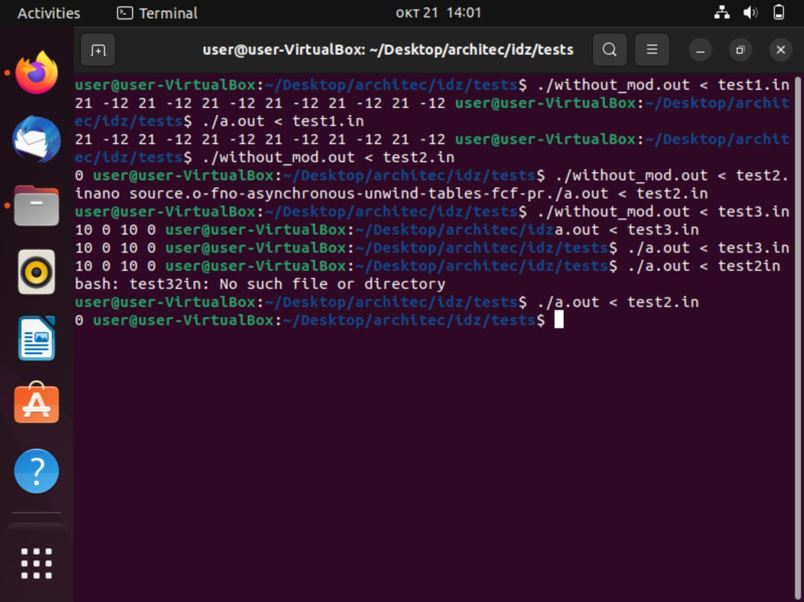

Файл foo.s скомпилирован с флагом -masm=intel  
Файл optimized.s скопилирован с флагами -fno-asynchronous-unwind-tables -fno-jump-tables -fno-stack-protector -fno-exceptions  
Тест 1:  
12  
1 2 -10 4 1 -1 -1 0 0 1 0 12  
Результаты:  
21 -12 21 -12 21 -12 21 -12 21 -12 21 -12  
21 -12 21 -12 21 -12 21 -12 21 -12 21 -12  
Тест 2:  
1  
0  
Результаты:  
0  
0  
Тест 3:  
4  
1 2 3 4  
Результаты:  
10 0 10 0  
10 0 10 0  

