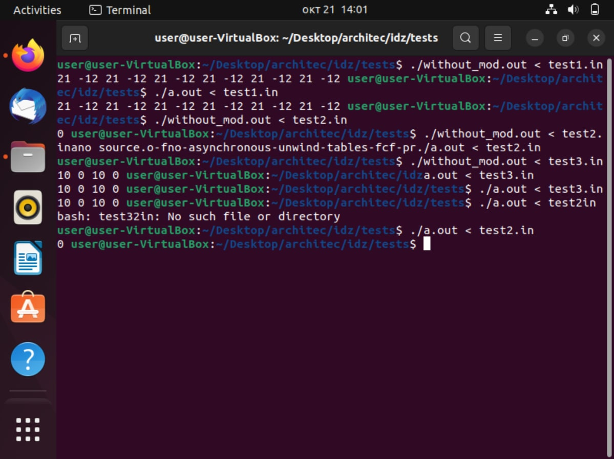
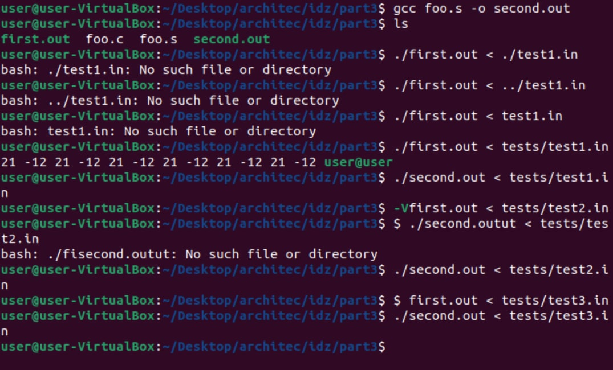
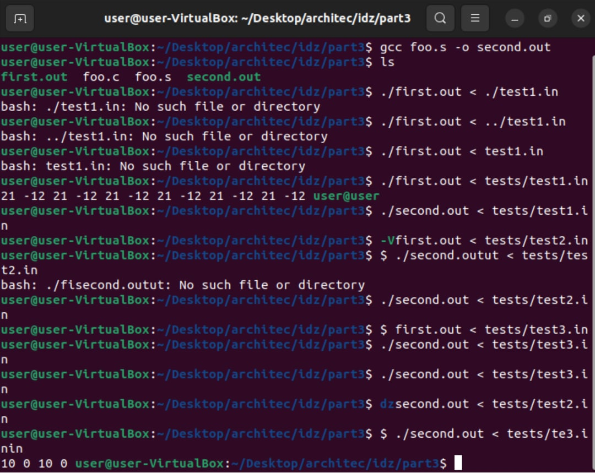
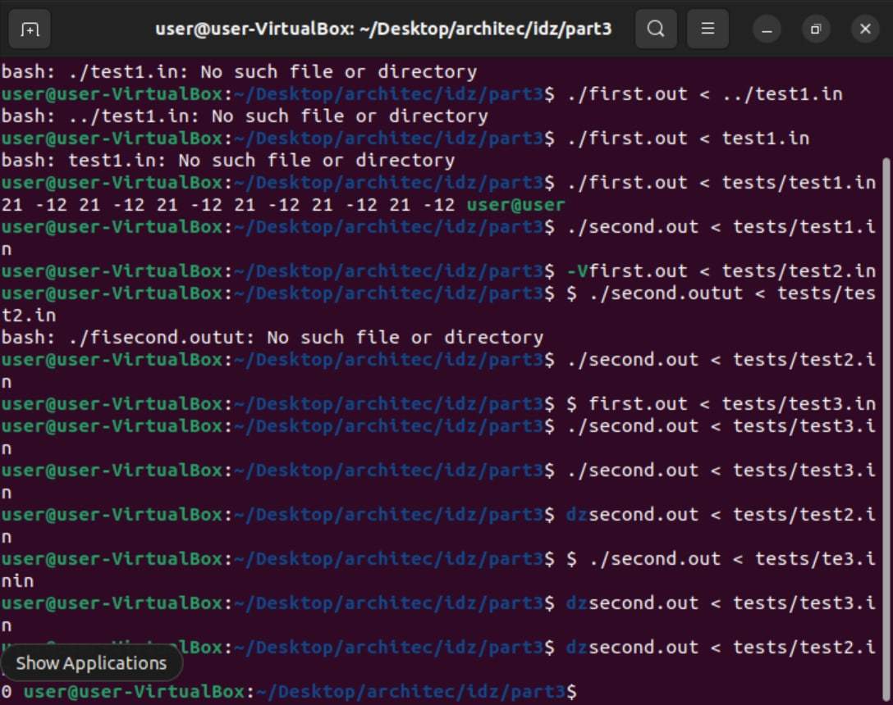
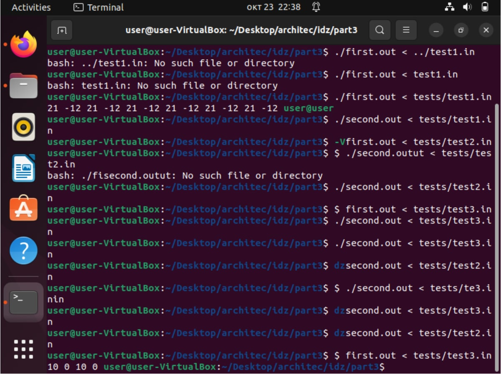

*ИДЗ № 1*
**Багрянский Константин Дмитриевчи БПИ 218**  
**Вариант №34**
Сформировать массив B из элементов массива A заменив элементы
на четным местах суммой всех положительных элементов, а элементы на
нечетных местах суммой отрицательных элементов.

Поскольку в задании не сказанно, что такое "элементы
на четным местах" я интерпритировал это как элементы с чётными индексами.
*Оценка 4*  **папка part1**  
Файл foo.c - решение на языке C.  
Файл foo.s скомпилирован с флагом -masm=intel  (Добавлены комментарии)  
Файл optimized.s скопилирован с флагами -masm=intel -fno-asynchronous-unwind-tables -fno-jump-tables -fno-stack-protector -fno-exceptions
Файл optimized.s отдельно откомпилирован и скомпонован.  
Полное тестовое покрытие программ:  
Тест 1:  
12  
1 2 -10 4 1 -1 -1 0 0 1 0 12  
Результаты:  
foo.s: 21 -12 21 -12 21 -12 21 -12 21 -12 21 -12  
optimized.s: 21 -12 21 -12 21 -12 21 -12 21 -12 21 -12  
Тест 2:  
1  
0  
Результаты:  
foo.s: 0  
optimized.s: 0  
Тест 3:  
4  
1 2 3 4  
Результаты:  
foo.s: 10 0 10 0  
optimized.s: 10 0 10 0  

Вывод: программы работают одинаково на всех тестах.  

*Оценка 5*  **папка part2**   
Переделано решение на C. Добавлены функции с передачей данных через параметры. В функциях использованы локальные переменные.  
Файл foo.c:  
find_neg_sum(int n) - находит сумму элементов меньших нуля и возвращяет её.
find_pos_sum(int n) - находит сумму элементов больших нуля и возвращяет её.
параметр n - кол-во элементов в массиве.
Файл foo.s:
Скомпилирован с флагами -masm=intel -fno-asynchronous-unwind-tables -fno-jump-tables -fno-stack-protector -fno-exceptions  
В ассемблерный код добавлены комментарии описывающие передачу параметров и перенос возращаемого результата, показывающие связь языка C и ассемблера.

*Оценка 6*  *папка part3*  
Была произведена переработка программы part2/foo.s за счёт использования максимального числа регистров  
Так же были добавлены комментарии поясняющие эквивалентные использования переменных в C
С результатом можно ознакомится в part3/foo.s
Так же полное тестовое покрытие:
Тест 1:  
12  
1 2 -10 4 1 -1 -1 0 0 1 0 12  
Результаты:  
old_foo.s: 21 -12 21 -12 21 -12 21 -12 21 -12 21 -12  
foo.s: 21 -12 21 -12 21 -12 21 -12 21 -12 21 -12  
Тест 2:  
1  
0  
Результаты:  
old_foo.s: 0  
foo.s: 0  
Тест 3:  
4  
1 2 3 4  
Результаты:  
old_foo.s: 10 0 10 0  
foo.s: 10 0 10 0  

Вывод одинаковый на обоих тестах.
На скриншоте old_foo.s - first.out, a second.out - foo.s.  
Консоль немного баговалось и некоторый текст пропал, поэтому предоставляю 4 скриншота, на которых видно проблему и некоторые тесты.

